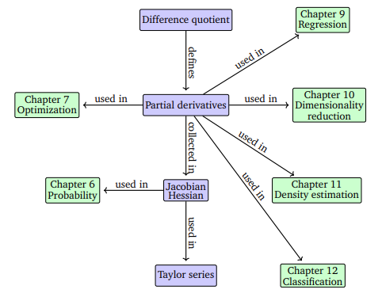

# Vector Calculus

Vector calculus plays a central role in machine learning, as many algorithms involve optimizing an objective function with respect to model parameters that determine how well the model explains the data. These optimization problems often rely on **gradient-based methods** to find the best parameters.

Examples include:

- **Linear regression** — optimizing linear weights to maximize likelihood (Chapter 9).    
- **Neural network autoencoders** — minimizing reconstruction error using the chain rule for derivatives.   
- **Gaussian mixture models** — optimizing location and shape parameters to best fit data distributions (Chapter 11).  

The core concept in this chapter is that of a **function**, which maps inputs \( \mathbf{x} \in \mathbb{R}^D \) to real-valued outputs \( f(\mathbf{x}) \in \mathbb{R} \). 
A function assigns each input exactly one output:
\[
f : \mathbb{R}^D \to \mathbb{R}, \quad \mathbf{x} \mapsto f(\mathbf{x})
\]

Gradients are essential because they point in the **direction of steepest ascent**, which allows optimization algorithms to improve model performance efficiently. Thus, **vector calculus** provides a fundamental mathematical foundation for many learning and optimization techniques used in machine learning.

Most functions in this context are assumed to be **differentiable**, though extensions to sub-differentials can handle non-differentiable cases. Optimization under constraints is discussed further in **Chapter 7**.

## Differentiation of Univariate Functions

Differentiation of univariate functions is fundamental in understanding how functions change with respect to their input.  A **derivative** measures the instantaneous rate of change or slope of the tangent line to a function at a point.

One can compute the slope of the secant line through two points on \( f(x) \) using the difference quotient.

**Difference Quotient**  
\[
\frac{\delta y}{\delta x} = \frac{f(x + \delta x) - f(x)}{\delta x}
\]

As \( \delta x \to 0 \), the secant approaches the tangent line.  We call the value of the difference quotient as $\delta x \rightarrow 0$ the derivative and use the notation $\frac{df}{dx}$ to denote the derivative.

**Derivative**  
\[
\frac{df}{dx} = \lim_{h \to 0} \frac{f(x + h) - f(x)}{h}
\]

The derivative represents the slope of the tangent to \( f \) at point \( x \). It points in the **direction of steepest ascent** of \( f \).

For \( f(x) = x^n \):
\[
\frac{df}{dx} = \lim_{h \to 0} \frac{(x + h)^n - x^n}{h} = nx^{n-1}
\]

---

### Taylor Series and Polynomial Approximation

A **Taylor series** approximates a function \( f(x) \) around a point \( x_0 \):
\[
T_\infty(x) = \sum_{k=0}^{\infty} \frac{f^{(k)}(x_0)}{k!}(x - x_0)^k
\]

If \( x_0 = 0 \), the Taylor series is known as the **Maclaurin series**.  If \( f(x) = T_\infty(x) \), then \( f \) is **analytic**.

Taylor Polynomial for \( f(x) = x^4 \)
At \( x_0 = 1 \):
\[
T_6(x) = 1 + 4(x - 1) + 6(x - 1)^2 + 4(x - 1)^3 + (x - 1)^4
\]
Expanding gives \( T_6(x) = x^4 = f(x) \).

Taylor Series of \( f(x) = \sin(x) + \cos(x) \)
At \( x_0 = 0 \):
\[
T_\infty(x) = \cos(x) + \sin(x)
\]
Derived using power series:
\[
\cos(x) = \sum_{k=0}^{\infty} \frac{(-1)^k x^{2k}}{(2k)!}, \quad
\sin(x) = \sum_{k=0}^{\infty} \frac{(-1)^k x^{2k+1}}{(2k+1)!}
\]

---

### Differentiation Rules

Let $f$ and $g$ be continuous functions.  Then:

1. **Product Rule**  
   \[
   (f(x)g(x))' = f'(x)g(x) + f(x)g'(x)
   \]  

2. **Quotient Rule**  
   \[
   \left( \frac{f(x)}{g(x)} \right)' = \frac{f'(x)g(x) - f(x)g'(x)}{[g(x)]^2}
   \]  

3. **Sum Rule**  
   \[
   (f(x) + g(x))' = f'(x) + g'(x)
   \]  

4. **Chain Rule**  
   For \( h(x) = g(f(x)) \):
   \[
   h'(x) = g'(f(x)) \cdot f'(x)
   \]  

Given \( f(x) = 2x + 1 \) and \( g(x) = x^4 \), if $h(x) = g(f(x)) = (2x+1)^4$, then
\[
h'(x) = g'(f) \cdot f'(x) = 4(2x + 1)^3 \cdot 2 = 8(2x + 1)^3
\]

---

### Exercises {.unnumbered .unlisted}

Differentiate $f(x) = e^x \sin(x) + \cos(\ln(x))$. 

[Solution]( )

 

Differentiate $f(x) = \dfrac{\ln(x)}{x^2 + x + 5}$. 
    

[Solution]( )

 

Differentiate $f(x) = \frac{\sin(x)\cos(x)}{x^2e^x}$.  Hint, take logs on both sides. 
    

[Solution]( )

 

Differentiate $g(x) = e^{\sin(x)e^x}$.  Hint, take logs on both sides. 
    

[Solution]( )

 

Find the Taylor series for $f(x) = x^4$ around $x_0 = 1$. 

[Solution]( )

 

Find the Taylor series for $f(x) = \cos(x)$ around $x_0 = 0$. 
    

[Solution]( )

 

Find the Taylor series for $f(x) = e^x$ around $x_0 = 0$.

[Solution]( )

 

## Partial Differentiation and Gradients

Partial derivatives extends differentiation to functions of multiple variables \( f(x_1, x_2, \ldots, x_n) = f(\mathbf{x})\).  The **gradient** generalizes the concept of the derivative for multivariate functions.  Each component of the gradient is a **partial derivative**, found by differentiating with respect to one variable while keeping others constant.

For a function \( f : \mathbb{R}^n \to \mathbb{R} \), the **partial derivative** with respect to each variable \( x_i \) is:
\[
\frac{\partial f}{\partial x_i} = \lim_{h \to 0} \frac{f(x_1, \ldots, x_i + h, \ldots, x_n) - f(x)}{h}
\]

Collecting all partial derivatives gives the **gradient (Jacobian)**:

The **Gradient** of a function of $n$ variables is the vector of first partial derivatives with respect to each variable.
\[
\nabla_x f = \text{grad} f = \frac{df}{d\mathbf{x}} =
\begin{bmatrix}
\frac{\partial f}{\partial x_1} & 
\frac{\partial f}{\partial x_2} &
\cdots &
\frac{\partial f}{\partial x_n}
\end{bmatrix}
\in \mathbb{R}^{1 \times n}
\]

The gradient is defined here as a **row vector** for consistency with later generalizations.

Given \( f(x, y) = (x + 2y^3)^2 \), we have
\[
\frac{\partial f}{\partial x} = 2(x + 2y^3)
\]
and
\[
\frac{\partial f}{\partial y} = 2(x + 2y^3) \cdot 6y^2 = 12y^2(x + 2y^3).
\]
So, the gradient for $f$ is given by
\[
\nabla_x f = \text{grad} f = \frac{df}{d\mathbf{x}} =\left[2(x + 2y^3), \;\;  12y^2(x + 2y^3) \right].\]

Although gradients are often represented as column vectors, this text defines them as row vectors.  By doing so, we have the following advantages:

  1. Allows consistent generalization to **vector-valued functions** \( f: \mathbb{R}^n \to \mathbb{R}^m \).  
  2. Enables a compact **matrix form of the multivariate chain rule**.

For \( f(x_1, x_2) = x_1^2x_2 + x_1x_2^3 \):
\[
\frac{\partial f}{\partial x_1} = 2x_1x_2 + x_2^3
\]
\[
\frac{\partial f}{\partial x_2} = x_1^2 + 3x_1x_2^2
\]
Hence, the gradient is:
\[
\frac{df}{d\mathbf{x} } =
\begin{bmatrix}
2x_1x_2 + x_2^3 & x_1^2 + 3x_1x_2^2
\end{bmatrix}
\in \mathbb{R}^{1 \times 2}
\]

---

### Basic Rules of Partial Differentiation

The basic differentiation rules extend naturally to multivariate functions.

Let $f$ and $g$ be continuous functions.

- **Product Rule:**  
  \[
  (f(\mathbf{x})g(\mathbf{x}))' = f'(\mathbf{x})g(\mathbf{x}) + f(\mathbf{x})g'(\mathbf{x})
  \]

- **Sum Rule:**  
  \[
  (f(\mathbf{x}) + g(\mathbf{x}))' = f'(\mathbf{x}) + g'(\mathbf{x})
  \]

- **Chain Rule:**  
  \[
  (g \circ f)'(\mathbf{x}) = g'(f(\mathbf{x})) f'(\mathbf{x})
  \]

---

### Multivariate Chain Rule (Matrix Form)

For functions of several variables, the **chain rule** can be written compactly as a matrix multiplication:
\[
\frac{df}{d(s, t)} =
\frac{\partial f}{\partial x}
\frac{\partial x}{\partial (s, t)}
\]

\[
=
\begin{bmatrix}
\frac{\partial f}{\partial x_1} & \frac{\partial f}{\partial x_2}
\end{bmatrix}
\begin{bmatrix}
\frac{\partial x_1}{\partial s} & \frac{\partial x_1}{\partial t} \\
\frac{\partial x_2}{\partial s} & \frac{\partial x_2}{\partial t}
\end{bmatrix}
\]

This form only works directly if the gradient is defined as a row vector.

Let  
\[
f(x, y) = x^2 y + \sin(y)
\]
where \(x\) and \(y\) are functions of a single variable \(t\) given by
\[
x(t) = t^2, \qquad y(t) = e^{t}.
\]
Compute  
\[
\frac{d}{dt} \, f(x(t), y(t)).
\]

By the multivariable chain rule,
\[
\frac{d}{dt} f(x(t), y(t))
= \frac{\partial f}{\partial x}\frac{dx}{dt}
+ \frac{\partial f}{\partial y}\frac{dy}{dt}.
\]

First compute the partial derivatives:
\[
\frac{\partial f}{\partial x} = 2xy, \qquad
\frac{\partial f}{\partial y} = x^2 + \cos(y).
\]

Next compute the derivatives of \(x(t)\) and \(y(t)\):
\[
\frac{dx}{dt} = 2t, \qquad
\frac{dy}{dt} = e^{t}.
\]

Substitute \(x(t) = t^2\) and \(y(t) = e^t\):
\[
\frac{d}{dt} f(x(t), y(t))
= (2 t^2 e^t)(2t) + (t^4 + \cos(e^t)) e^t= 4 t^3 e^t + t^4 e^t + e^t \cos(e^t)
\]

---

### Exercises {.unnumbered .unlisted}

Find the gradient of $f\left( {x,y,z} \right) = {x^2}z + {y^3}{z^2} - xyz$. 

[Solution]( )

 

Find the gradient of $f(x,y) = xe^{xy}$.  

[Solution]( )

 

Find the gradient of $f\left( {x,y} \right) = x\cos \left( y \right)$. 

[Solution]( )

 

Find the gradient of $f\left( {x,y,z} \right) = \sin \left( {yz} \right) + \ln \left( {{x^2}} \right)$. 

[Solution]( )

 

The rate of change of $f(x,y,z)$ in the direction of a unit vector $\mathbf{u}$ is called the directional derivative and is denoted by $D_{\mathbf{u}} f(x,y,z)$.  We can show that \[D_u f(x,y,z) = \langle f_x, f_y, f_z \rangle \cdot \langle a,b,c \rangle,\]  with $\mathbf{u} = <a,b,c>$.  Prove that the maximum value  of $D_{\mathbf{u}} f(x,y,z)$ (and hence the maximum rate of change of $f(x,y,z)$) is given by $||\nabla f(x,y,z)||$ will occur in the direction given by $\nabla f(x,y,z)$. 

[Solution]( )

 

Prove that the gradient vector $\nabla f(x_0,y_0)$ is orthogonal to the level curve $f(x,y) = k$ at the point $(x(t_0),y(t_0)) = (x_0,y_0)$. 

[Solution]( )

 

Find $\frac{dz}{dt}$ for \[z = xe^{xy}, \;\;\;\; x = t^2, \;\;\;\; y = t^{-1}.\]

[Solution]( )

 

  Find $\frac{dz}{dt}$ for \[z = {x^2}{y^3} + y\cos x, \;\;\;\; x = \ln(t^2), \;\;\;\; y = \sin(4t).\] 
  

[Solution]( )

 

Find $\frac{dz}{dx}$ for \[z = x\ln \left( {xy} \right) + {y^3}, \;\;\;\; y=\cos(x^2+1).\]

[Solution]( )

 

##  Gradients of Vector-Valued Functions

In previous sections, we studied gradients of scalar functions \( f: \mathbb{R}^n \to \mathbb{R} \).  We now generalize to **vector-valued functions** \( \mathbf{f}: \mathbb{R}^n \to \mathbb{R}^m \), where \( m > 1 \).

A **vector valued function** $\mathbf{f}:\mathbb{R}^n \rightarrow \mathbb{R}^m$ can be written as:
  \[
  \mathbf{f}(\mathbf{x}) =
  \begin{bmatrix}
  f_1(\mathbf{x}) \\ \vdots \\ f_m(\mathbf{x})
  \end{bmatrix}
  \in \mathbb{R}^m
  \]
  where each \( f_i: \mathbb{R}^n \to \mathbb{R} \).

Define the function
\[
\mathbf{r}(t) =
\begin{bmatrix}
\cos t \\
\sin t
\end{bmatrix},
\quad t \in \mathbb{R}.
\]
Each input \(t\) produces a 2D vector.  This function traces out the unit circle in \(\mathbb{R}^2\).

Define
\[
\mathbf{r}(t) =
\begin{bmatrix}
t \\
t^2 \\
e^t
\end{bmatrix}.
\]  The input is a scalar \(t\).  The output is a vector in \(\mathbb{R}^3\).  Each component is an ordinary real-valued function.

- The **Jacobian** collects all first-order partial derivatives of \( \mathbf{f} \):
  \[
  \mathbf{J} = \nabla_x \mathbf{f} = \frac{d\mathbf{f}(\mathbf{x})}{d\mathbf{x}} =
  \begin{bmatrix}
  \frac{\partial f_1}{\partial x_1} & \cdots & \frac{\partial f_1}{\partial x_n} \\
  \vdots & \ddots & \vdots \\
  \frac{\partial f_m}{\partial x_1} & \cdots & \frac{\partial f_m}{\partial x_n}
  \end{bmatrix}
  \in \mathbb{R}^{m \times n}
  \]

Each element \( \mathbf{J}(i, j) = \frac{\partial f_i}{\partial x_j} \) gives the rate of change of the \( i^{th} \) output with respect to the \( j^{th} \) input. 

Consider the vector-valued function  
\[
\mathbf{f} : \mathbb{R}^2 \to \mathbb{R}^3
\]
defined by
\[
\mathbf{f}(x,y) =
\begin{bmatrix}
x^2 + y \\
xy \\
\sin x
\end{bmatrix}.
\]
The partial derivatives are:

- \( f_1(x,y) = x^2 + y \)
  \[
  \frac{\partial f_1}{\partial x} = 2x, 
  \quad
  \frac{\partial f_1}{\partial y} = 1
  \]
- \( f_2(x,y) = xy \)
  \[
  \frac{\partial f_2}{\partial x} = y,
  \quad
  \frac{\partial f_2}{\partial y} = x
  \]
- \( f_3(x,y) = \sin x \)
  \[
  \frac{\partial f_3}{\partial x} = \cos x,
  \quad
  \frac{\partial f_3}{\partial y} = 0
  \]

Thus, the Jacobian for $\mathbf{f}$ is 
\[
\mathbf{J}_{\mathbf{f}}(x,y) =
\begin{bmatrix}
2x & 1 \\
y & x \\
\cos x & 0
\end{bmatrix}.
\]

This book adopts the **numerator layout**:  
  The derivative \( \frac{d\mathbf{f}}{d\mathbf{x}} \) is an \( m \times n \) matrix — rows correspond to function outputs, columns to input variables.

The **Jacobian determinant** \( |\det(\mathbf{J})| \) represents how a transformation scales areas or volumes.  For example, a mapping with \( |\det(\mathbf{J})| = 3 \) triples the area (or volume) of a region.  This property becomes important in probability (e.g., change of variables in Section 6.7).

For **linear mappings**, such as \( y = \mathbf{\mathbf{J}}\mathbf{x} \), the Jacobian is simply the transformation matrix \( \mathbf{J} \). For **nonlinear mappings**, the Jacobian provides a **local linear approximation** around a point.

Given \(\mathbf{f}(\mathbf{x}) = \mathbf{A}\mathbf{x} \), where \( \mathbf{A} \in \mathbb{R}^{M \times N} \) and \( \mathbf{x} \in \mathbb{R}^N \):
  \[
  \frac{d\mathbf{f}}{d\mathbf{x}} = \mathbf{A}
  \]
  since each element \( \frac{\partial f_i}{\partial x_j} = A_{ij} \).

For compositions \( h(t) = f(\mathbf{g}(t)) \) with \( f: \mathbb{R}^2 \to \mathbb{R} \) and \( \mathbf{g}: \mathbb{R} \to \mathbb{R}^2 \),
  the chain rule generalizes to:
  \[
  \frac{dh}{dt} = \frac{\partial f}{\partial \mathbf{g}} \frac{\partial \mathbf{g}}{\partial t}
  \]
  where matrix multiplication replaces scalar multiplication in the standard chain rule.

  
  

Let  
\[
\mathbf{g} : \mathbb{R} \to \mathbb{R}^2
\quad \text{and} \quad
f : \mathbb{R}^2 \to \mathbb{R}
\]
be defined by
\[
\mathbf{g}(t) =
\begin{bmatrix}
t^2 \\
\sin t
\end{bmatrix},
\qquad
f(x,y) = x y.
\]

Define the composition
\[
h(t) = f(\mathbf{g}(t)).
\]

**Step 1: Write the Composition Explicitly**

Substitute \( \mathbf{g}(t) \) into \( f \):
\[
h(t) = f(t^2, \sin t) = t^2 \sin t.
\]

**Step 2: Apply the Chain Rule**

The multivariable chain rule states:
\[
h'(t) = \nabla f(\mathbf{g}(t)) \cdot \mathbf{g}'(t).
\]

**Step 3: Compute Each Component**

-  Gradient of \( f \):
\[
\nabla f(x,y) =
\begin{bmatrix}
\frac{\partial f}{\partial x} \\
\frac{\partial f}{\partial y}
\end{bmatrix}
=
\begin{bmatrix}
y \\
x
\end{bmatrix}.
\]

Evaluate at \( \mathbf{g}(t) = (t^2, \sin t) \):
\[
\nabla f(\mathbf{g}(t)) =
\begin{bmatrix}
\sin t \\
t^2
\end{bmatrix}.
\]

-   Derivative of \( \mathbf{g}(t) \):
\[
\mathbf{g}'(t) =
\begin{bmatrix}
2t \\
\cos t
\end{bmatrix}.
\]

**Step 4: Compute \( h'(t) \)**

\[
h'(t) = \nabla f(\mathbf{g}(t)) \cdot \mathbf{g}'(t)
=
\begin{bmatrix}
\sin t & t^2
\end{bmatrix}
\begin{bmatrix}
2t \\
\cos t
\end{bmatrix}
=
2t \sin t + t^2 \cos t.
\]

To Check, we can differentiate directly:
\[
h(t) = t^2 \sin t
\quad \Rightarrow \quad
h'(t) = 2t \sin t + t^2 \cos t,
\]
which agrees with the chain rule result.

For a linear model \( \mathbf{y} = \mathbf{\Phi} \mathbf{\theta} \) with residuals \( \mathbf{e}(\mathbf{\theta}) = \mathbf{y} - \mathbf{\Phi} \mathbf{\theta} \),
  the least-squares loss is:
  \[
  L( \mathbf{e} ) = \| \mathbf{e} \|^2 = \mathbf{e}^\top \mathbf{e}
  \]
Applying the chain rule gives:
\begin{align*}
\frac{\partial L}{\partial \mathbf{\theta}} 
&= \frac{\partial L}{\partial \mathbf{e}}\frac{\partial \mathbf{e}}{\partial \mathbf{\theta}} \\
&= -2 \mathbf{e}^\top \mathbf{\Phi}\\
&= -2 (\mathbf{y}^\top - \mathbf{\theta}^\top \mathbf{\Phi}^\top) \mathbf{\Phi}.
\end{align*}
This result forms the basis for optimization in linear regression (explored further in Chapter 9).

---

### Dimensional Summary of Derivatives

| Function Type        | Gradient Dimension  |
|----------------------|---------------------|
| \( f: \mathbb{R} \to \mathbb{R} \)   | Scalar (1 × 1)         |
| \( f: \mathbb{R}^D \to \mathbb{R} \) | Row vector (1 × D)     |
| \( f: \mathbb{R} \to \mathbb{R}^E \) | Column vector (E × 1)  |
| \( f: \mathbb{R}^D \to \mathbb{R}^E \) | Matrix (E × D)         |

---

### Exercises {.unnumbered .unlisted}

Compute the Jacobian for $x = 4u-3v^2$ and $y = u^2-6v$.

[Solution]( )

 

Compute the Jacobian for $x = \sqrt{u}$ and $y = 10u + v$.

[Solution]( )

 

Compute the Jacobian for $x = v^3u$ and $y = u^2/v$.

[Solution]( )

 

Compute the Jacobian for $x = u^2v^3$ and $y = 4-2\sqrt{u}$.

[Solution]( )

 

Define a matrix $\mathbf{A}$ to be $3 \times 3$ and a vector $\mathbf{x}$ to be length 3.  Define $\mathbf{f}(\mathbf{x}) = \mathbf{A} \mathbf{x}$. Compute $d \mathbf{f}/d \mathbf{x}$.

[Solution]( )

 

Let $r(t) = \left[t^2 + 1, 3-t, t^3 \right]$.  Find the unit tangent vector in the direction of $r$.

[Solution]( )

 

Prove each of the following rules
\begin{array}{lrcll} \mathrm{i.} & \dfrac{d}{\,dt}[c\mathbf{r}(t)] & = & c\mathbf{r}′(t) & \text{Scalar multiple} \nonumber\\ 
\mathrm{ii.} & \dfrac{d}{\,dt}[\mathbf{r}(t)±\mathbf{u}(t)] & = & \mathbf{r}′(t)±\mathbf{u}′(t) & \text{Sum and difference} \nonumber\\ 
\mathrm{iii.} & \dfrac{d}{\,dt}[f(t)\mathbf{u}(t)] & = & f′(t)\mathbf{u}(t)+f(t)\mathbf{u}′(t) & \text{Scalar product} \nonumber\\ 
\mathrm{iv.} & \dfrac{d}{\,dt}[\mathbf{r}(t)⋅\mathbf{u}(t)] & = & \mathbf{r}′(t)⋅\mathbf{u}(t)+\mathbf{r}(t)⋅\mathbf{u}′(t) & \text{Dot product} \nonumber\\ 
\mathrm{v.} & \dfrac{d}{\,dt}[\mathbf{r}(f(t))] & = & \mathbf{r}′(f(t))⋅f′(t) & \text{Chain rule} \nonumber\\ 
\mathrm{vi.} & \text{If} \; \mathbf{r}(t)·\mathbf{r}(t) & = & c, \text{then} \; \mathbf{r}(t)⋅\mathbf{r}′(t) \; =0 \; . & \mathrm{} \nonumber \end{array} \nonumber

[Solution]( )

 

## Gradients of Matrices

In many machine learning applications, we need to compute **gradients of matrices** with respect to vectors or other matrices.  The result is typically a **multidimensional tensor**, which can be viewed as an array of partial derivatives.

---

### Gradients as Tensors

If \( \mathbf{A} \in \mathbb{R}^{m \times n} \) and \( \mathbf{B} \in \mathbb{R}^{p \times q} \), then the Jacobian of \( \mathbf{A} \) with respect to \( \mathbf{B} \) is a tensor of shape:
  \[
  \mathbf{J} \in \mathbb{R}^{(m \times n) \times (p \times q)}
  \]
  with entries:
  \[
  \mathbf{J}_{ijkl} = \frac{\partial \mathbf{A}_{ij}}{\partial \mathbf{B}_{kl}}
  \]

Because matrices represent linear mappings, there exists a vector-space isomorphism between \( \mathbb{R}^{m \times n} \) and \( \mathbb{R}^{mn} \). This means matrices can be **flattened** (by stacking columns) into vectors, allowing gradients to be represented as **matrices** instead of tensors.

Working with flattened matrices simplifies computation: the chain rule becomes standard matrix multiplication, whereas tensor gradients require summing across multiple dimensions.

Given:
\[
f = \mathbf{A} \mathbf{x}, \quad \mathbf{f} \in \mathbb{R}^M, \; \mathbf{A} \in \mathbb{R}^{M \times N}, \; \mathbf{x} \in \mathbb{R}^N
\]
we seek \( \frac{d\mathbf{f}}{d\mathbf{A}} \).

- The gradient has dimension:
  \[
  \frac{d \mathbf{f}}{d\mathbf{A}} \in \mathbb{R}^{M \times (M \times N)}
  \]

- For each component:
  \[
  f_i = \sum_{j=1}^{N} \mathbf{A}_{ij} x_j
  \Rightarrow
  \frac{\partial f_i}{\partial \mathbf{A}_{iq}} = x_q
  \]

- The partial derivatives with respect to each row of \( \mathbf{A} \) are:
  \[
  \frac{\partial f_i}{\partial \mathbf{A}_{i,:}} = x^\top, \quad
  \frac{\partial f_i}{\partial \mathbf{A}_{k \neq i,:}} = 0^\top
  \]

- Stacking these gives the full gradient tensor:
  \[
  \frac{\partial f_i}{\partial \mathbf{A}} =
  \begin{bmatrix}
  0^\top \\ \vdots \\ 0^\top \\ x^\top \\ 0^\top \\ \vdots \\ 0^\top
  \end{bmatrix}
  \in \mathbb{\mathbf{R}}^{1 \times (M \times N)}
  \]

Let:
\[
\mathbf{f}(\mathbf{R}) = \mathbf{R}^\top \mathbf{R} = \mathbf{K}, \quad \mathbf{R} \in \mathbb{\mathbf{R}}^{M \times N}, \; \mathbf{K} \in \mathbb{\mathbf{R}}^{N \times N}
\]
We want \( \frac{d\mathbf{K}}{d\mathbf{R}} \).

- The gradient tensor has dimensions:
  \[
  \frac{d\mathbf{K}}{d\mathbf{R}} \in \mathbb{\mathbf{R}}^{(N \times N) \times (M \times N)}
  \]

- Each entry of \( \mathbf{K} \) is defined as:
  \[
  K_{pq} = r_p^\top r_q = \sum_{m=1}^{M} R_{mp} R_{mq}
  \]

- Differentiating gives:
  \[
  \frac{\partial K_{pq}}{\partial R_{ij}} =
  \begin{cases}
  R_{iq}, & \text{if } j = p, \; p \neq q \\
  R_{ip}, & \text{if } j = q, \; p \neq q \\
  2R_{iq}, & \text{if } j = p, \; p = q \\
  0, & \text{otherwise}
  \end{cases}
  \]

- Therefore, every element of the gradient tensor \( \frac{d\mathbf{K}}{d\mathbf{R}} \) is determined by how each matrix element \( R_{ij} \) contributes to every element \( K_{pq} \) of \( \mathbf{K} \).

---

### Exercises {.unnumbered .unlisted}

The following rules describe matrix derivatives in a general setting.  Each rule can be proved using small-dimensional examples (e.g., \(2\times2\) or \(3\times3\) matrices) by differentiating entrywise.  Prove each result below.  Throughout, let:

- \( \mathbf{A}(t), \mathbf{B}(t) \) be matrix-valued functions of compatible sizes
- \( c \in \mathbb{R} \) be a constant
- \( \mathbf{x}(t) \) be a vector-valued function

1. Entrywise Differentiation:  Matrix derivatives are defined componentwise:
\[
\frac{d}{dt}\mathbf{A}(t)
=
\left[ \frac{d}{dt} a_{ij}(t) \right].
\]
This rule justifies all others.

2. Constant Matrix Rule:  If \( \mathbf{A} \) is constant (independent of \(t\)), then
\[
\frac{d}{dt}\mathbf{A} = \mathbf{0}.
\]

3. Constant Multiple Rule
\[
\frac{d}{dt}[c\mathbf{A}(t)] = c\,\mathbf{A}'(t).
\]

4. Sum Rule:  If \( \mathbf{A}(t) \) and \( \mathbf{B}(t) \) have the same dimensions,
\[
\frac{d}{dt}[\mathbf{A}(t) + \mathbf{B}(t)]
=
\mathbf{A}'(t) + \mathbf{B}'(t).
\]

5. Matrix–Vector Product Rule:  If \( \mathbf{A}(t) \in \mathbb{R}^{m\times n} \) and \( \mathbf{x}(t) \in \mathbb{R}^n \),
\[
\frac{d}{dt}[\mathbf{A}(t)\mathbf{x}(t)]
=
\mathbf{A}'(t)\mathbf{x}(t) + \mathbf{A}(t)\mathbf{x}'(t).
\]
This is the matrix analogue of the product rule.

6. Scalar–Matrix Product Rule: If \( f(t) \in \mathbb{R} \),
\[
\frac{d}{dt}[f(t)\mathbf{A}(t)]
=
f'(t)\mathbf{A}(t) + f(t)\mathbf{A}'(t).
\]

7. Matrix–Matrix Product Rule:  If \( \mathbf{A}(t)\mathbf{B}(t) \) is defined,
\[
\frac{d}{dt}[\mathbf{A}(t)\mathbf{B}(t)]
=
\mathbf{A}'(t)\mathbf{B}(t) + \mathbf{A}(t)\mathbf{B}'(t).
\]

8. Transpose Rule
\[
\frac{d}{dt}[\mathbf{A}(t)^\top]
=
(\mathbf{A}'(t))^\top.
\]

9. Quadratic Form (Vector Case):  If \( \mathbf{x}(t) \in \mathbb{R}^n \) and \( \mathbf{A} \) is constant,

\[
\frac{d}{dt}[\mathbf{x}(t)^\top \mathbf{A} \mathbf{x}(t)]
=
\mathbf{x}'(t)^\top \mathbf{A} \mathbf{x}(t)
+
\mathbf{x}(t)^\top \mathbf{A} \mathbf{x}'(t).
\]
If \( \mathbf{A} \) is symmetric, this simplifies to:
\[
= 2\,\mathbf{x}'(t)^\top \mathbf{A} \mathbf{x}(t).
\]

10. Inverse Matrix Rule (Advanced but Verifiable):  If \( \mathbf{A}(t) \) is invertible for all \(t\),
\[
\frac{d}{dt}[\mathbf{A}(t)^{-1}]
=
-\,\mathbf{A}(t)^{-1}\mathbf{A}'(t)\mathbf{A}(t)^{-1}.
\]
This follows from differentiating:
\[
\mathbf{A}(t)\mathbf{A}(t)^{-1} = \mathbf{I}.
\]

[Solution]( )

 

## Useful Identities for Computing Gradients

This section lists key gradient identities that are frequently used in machine learning applications (based on Petersen and Pedersen, 2012). Important matrix operations include the **trace** `tr(·)`, the **determinant** `det(·)`, and the **inverse** of a matrix `f(X)^{-1}` (when it exists).

1. **Transpose Rule**
   $$
   \frac{\partial \mathbf{f}(\mathbf{X})^{\top}}{\partial \mathbf{X}} = \left(\frac{\partial \mathbf{f}(\mathbf{X})}{\partial \mathbf{X}}\right)^{\top}
   $$

2. **Trace Rule**
   $$
   \frac{\partial \, \text{tr}(\mathbf{f}(\mathbf{X}))}{\partial \mathbf{X}} = \text{tr}\left(\frac{\partial \mathbf{f}(\mathbf{X})}{\partial \mathbf{X}}\right)
   $$

3. **Determinant Rule**
   $$
   \frac{\partial \, \text{det}(\mathbf{f}(\mathbf{X}))}{\partial \mathbf{X}} = \text{det}(\mathbf{f}(\mathbf{X})) \, \text{tr}\left(\mathbf{f}(\mathbf{X})^{-1} \frac{\partial \mathbf{f}(\mathbf{X})}{\partial \mathbf{X}}\right)
   $$

4. **Inverse Rule**
   $$
   \frac{\partial \mathbf{f}(\mathbf{X})^{-1}}{\partial \mathbf{X}} = -\mathbf{f}(\mathbf{X})^{-1} \frac{\partial \mathbf{f}(\mathbf{X})}{\partial \mathbf{X}} \mathbf{f}(\mathbf{X})^{-1}
   $$

5. **Quadratic Form Rules**
   - For vectors \( \mathbf{a}, \mathbf{b} \) and invertible matrix \( \mathbf{X} \):
     $$
     \frac{\partial (\mathbf{a}^{\top} \mathbf{X}^{-1} \mathbf{b})}{\partial \mathbf{X}} = - (\mathbf{X}^{-1})^{\top} \mathbf{a} \mathbf{b}^{\top} (\mathbf{X}^{-1})^{\top}
     $$
     
   - For vector \( \mathbf{x} \) and constant vector \( \mathbf{a} \):
     $$
     \frac{\partial (\mathbf{x}^{\top} \mathbf{a})}{\partial \mathbf{x}} = \mathbf{a}^{\top}
     \quad \text{and} \quad
     \frac{\partial (\mathbf{a}^{\top} \mathbf{x})}{\partial \mathbf{x}} = \mathbf{a}^{\top}
     $$  
   - For \( \mathbf{a}^{\top} \mathbf{X} \mathbf{b} \):
     $$
     \frac{\partial (\mathbf{a}^{\top} \mathbf{X} \mathbf{b})}{\partial \mathbf{X}} = \mathbf{a} \mathbf{b}^{\top}
     $$  
   - For symmetric \( \mathbf{B} \):
     $$
     \frac{\partial (\mathbf{x}^{\top} \mathbf{B} \mathbf{x})}{\partial \mathbf{x}} = \mathbf{x}^{\top} (\mathbf{B} + \mathbf{B}^{\top})
     $$  
   - For symmetric \( \mathbf{W} \):
     $$
     \frac{\partial (\mathbf{x} - \mathbf{A}\mathbf{s})^{\top} \mathbf{W} (\mathbf{x} - \mathbf{A}\mathbf{s})}{\partial \mathbf{s}} = -2 (\mathbf{x} - \mathbf{A}\mathbf{s})^{\top} \mathbf{W} \mathbf{A}
     $$ 

---

### Exercises {.unnumbered .unlisted}

For each of the following properties, prove them for small matrices.

1. **Transpose Rule**
   $$
   \frac{\partial \mathbf{f}(\mathbf{X})^{\top}}{\partial \mathbf{X}} = \left(\frac{\partial \mathbf{f}(\mathbf{X})}{\partial \mathbf{X}}\right)^{\top}
   $$

2. **Trace Rule**
   $$
   \frac{\partial \, \text{tr}(\mathbf{f}(\mathbf{X}))}{\partial \mathbf{X}} = \text{tr}\left(\frac{\partial \mathbf{f}(\mathbf{X})}{\partial \mathbf{X}}\right)
   $$

3. **Determinant Rule**
   $$
   \frac{\partial \, \text{det}(\mathbf{f}(\mathbf{X}))}{\partial \mathbf{X}} = \text{det}(\mathbf{f}(\mathbf{X})) \, \text{tr}\left(\mathbf{f}(\mathbf{X})^{-1} \frac{\partial \mathbf{f}(\mathbf{X})}{\partial \mathbf{X}}\right)
   $$

4. **Inverse Rule**
   $$
   \frac{\partial \mathbf{f}(\mathbf{X})^{-1}}{\partial \mathbf{X}} = -\mathbf{f}(\mathbf{X})^{-1} \frac{\partial \mathbf{f}(\mathbf{X})}{\partial \mathbf{X}} \mathbf{f}(\mathbf{X})^{-1}
   $$
5. **Quadratic Form Rules**
   - For vectors \( \mathbf{a}, \mathbf{b} \) and invertible matrix \( \mathbf{X} \):
     $$
     \frac{\partial (\mathbf{a}^{\top} \mathbf{X}^{-1} \mathbf{b})}{\partial \mathbf{X}} = - (\mathbf{X}^{-1})^{\top} \mathbf{a} \mathbf{b}^{\top} (\mathbf{X}^{-1})^{\top}
     $$
     
   - For vector \( \mathbf{x} \) and constant vector \( \mathbf{a} \):
     $$
     \frac{\partial (\mathbf{x}^{\top} \mathbf{a})}{\partial \mathbf{x}} = \mathbf{a}^{\top}
     \quad \text{and} \quad
     \frac{\partial (\mathbf{a}^{\top} \mathbf{x})}{\partial \mathbf{x}} = \mathbf{a}^{\top}
     $$  
   - For \( \mathbf{a}^{\top} \mathbf{X} \mathbf{b} \):
     $$
     \frac{\partial (\mathbf{a}^{\top} \mathbf{X} \mathbf{b})}{\partial \mathbf{X}} = \mathbf{a} \mathbf{b}^{\top}
     $$  
   - For symmetric \( \mathbf{B} \):
     $$
     \frac{\partial (\mathbf{x}^{\top} \mathbf{B} \mathbf{x})}{\partial \mathbf{x}} = \mathbf{x}^{\top} (\mathbf{B} + \mathbf{B}^{\top})
     $$  
   - For symmetric \( \mathbf{W} \):
     $$
     \frac{\partial (\mathbf{x} - \mathbf{A}\mathbf{s})^{\top} \mathbf{W} (\mathbf{x} - \mathbf{A}\mathbf{s})}{\partial \mathbf{s}} = -2 (\mathbf{x} - \mathbf{A}\mathbf{s})^{\top} \mathbf{W} \mathbf{A}
     $$ 

