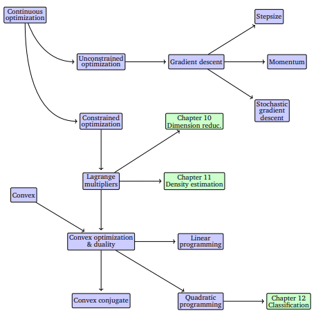

# Continuous Optimization

Machine learning training often involves finding the best set of parameters that minimize an objective function, which measures how well a model fits the data. This search for optimal parameters is formulated as a **continuous optimization problem**, since the parameters typically take values in \( \mathbb{R}^D \).

Optimization problems can be divided into two main types:

- **Unconstrained optimization**, where parameters can take any value in \( \mathbb{R}^D \).
- **Constrained optimization**, where parameters must satisfy specific restrictions.

Most objective functions in machine learning are differentiable, allowing the use of gradients to find minima. The gradient points in the direction of steepest ascent, so algorithms typically move in the opposite direction (downhill) to minimize the function. The step size determines how far to move along this direction.

The goal is to find points where the gradient is zero — these are **stationary points**. A stationary point can be:

- A **local minimum** (second derivative \( > 0 \)),  
- A **local maximum** (second derivative \( < 0 \)), or  
- A **saddle point**.  

An example function  
\[
\ell(x) = x^4 + 7x^3 + 5x^2 - 17x + 3
\]
demonstrates multiple stationary points — two minima and one maximum — found by setting the derivative  
\[
\frac{d\ell(x)}{dx} = 4x^3 + 21x^2 + 10x - 17 = 0
\]
to zero and analyzing the sign of the second derivative.

In practice, analytical solutions are often not feasible, especially for high-degree polynomials (by the Abel–Ruffini theorem, equations of degree ≥5 cannot be solved algebraically). Instead, we rely on numerical optimization algorithms that iteratively follow the negative gradient.

A key concept introduced later in the chapter is **convex optimization**.  For **convex functions**, every local minimum is also a global minimum, which guarantees that gradient-based methods will converge to the optimal solution regardless of the starting point. Many machine learning objectives are designed to be convex for this reason.

While the examples here are one-dimensional, the same principles extend to multidimensional optimization, though visualization becomes more challenging. Gradients, step directions, and curvature generalize to higher-dimensional parameter spaces.
 

## Optimization Using Gradient Descent

Optimization methods are central to training machine learning models. In this section, we study **gradient-based optimization**, where we iteratively improve parameters by following the negative gradient of an objective function.

Gradient descent is a **first-order optimization algorithm** used to find a local minimum of a differentiable function \( f: \mathbb{R}^d \to \mathbb{R} \). 

The **gradient descent** algorithm begins with an initial guess $\mathbf{x}_0$.  At each iteration, parameters are updated as:
\[
\mathbf{x}_{i+1} = \mathbf{x}_i - \gamma_i (\nabla f(\mathbf{x}_i))^\top ,
\]
where \( \gamma_i \) is the **step-size** (or **learning rate**).

The gradient points in the direction of steepest ascent, so moving in the opposite direction decreases the function value.

Gradient Descent on a Simple Quadratic Function

Consider the quadratic function
\[
f(x) = (x - 3)^2.
\]
This function has a **global minimum** at \( x = 3 \).

The derivative (gradient) of \( f \) is
\[
\nabla f(x) = f'(x) = 2(x - 3).
\]
Gradient descent updates the variable \( x \) according to
\[
x_{k+1} = x_k - \gamma \nabla f(x_k),
\]
where \( \gamma > 0 \) is the **learning rate**.

Substituting the gradient:
\[
x_{k+1} = x_k - \gamma \, 2(x_k - 3).
\]
Let the initial value be \( x_0 = 0 \) and choose \( \gamma = 0.1 \).
\[
x_1 = 0 - 0.1 \cdot 2(0 - 3) = 0.6
\]
\[
x_2 = 0.6 - 0.1 \cdot 2(0.6 - 3) = 1.08
\]
\[
x_3 = 1.08 - 0.1 \cdot 2(1.08 - 3) = 1.464
\]
Each step moves \( x_k \) closer to the minimizer \( x = 3 \).

The gradient points in the direction of steepest increase. Gradient descent moves in the opposite direction, reducing the function value. Because \( f(x) \) is convex, gradient descent converges to the global minimum.

A simple example with a quadratic function demonstrates how iterative updates move toward the minimum value. However, if the problem is poorly conditioned (e.g., shaped like a long narrow valley), convergence becomes slow and oscillatory.

Gradient Descent on a Two-Variable Quadratic Function

Consider the function
\[
f(x, y) = (x - 2)^2 + (y + 1)^2.
\]
This is a **convex quadratic** function with a global minimum at
\[
(x^\ast, y^\ast) = (2, -1).
\]

The gradient of \( f \) is
\[
\nabla f(x, y)
=
\begin{bmatrix}
\frac{\partial f}{\partial x} \\
\frac{\partial f}{\partial y}
\end{bmatrix}
=
\begin{bmatrix}
2(x - 2) \\
2(y + 1)
\end{bmatrix}.
\]

Gradient descent updates the variables according to
\[
\begin{bmatrix}
x_{k+1} \\
y_{k+1}
\end{bmatrix}
=
\begin{bmatrix}
x_k \\
y_k
\end{bmatrix}
-
\gamma
\begin{bmatrix}
2(x_k - 2) \\
2(y_k + 1)
\end{bmatrix},
\]
where \( \gamma > 0 \) is the **learning rate**.

Let the initial point be
\[
(x_0, y_0) = (0, 0),
\]
and choose \( \gamma = 0.1 \).

- **Iteration 1**
\[
\begin{aligned}
x_1 &= 0 - 0.1 \cdot 2(0 - 2) = 0.4, \\
y_1 &= 0 - 0.1 \cdot 2(0 + 1) = -0.2.
\end{aligned}
\]

- **Iteration 2**
\[
\begin{aligned}
x_2 &= 0.4 - 0.1 \cdot 2(0.4 - 2) = 0.72, \\
y_2 &= -0.2 - 0.1 \cdot 2(-0.2 + 1) = -0.36.
\end{aligned}
\]

- **Iteration 3**
\[
\begin{aligned}
x_3 &= 0.72 - 0.1 \cdot 2(0.72 - 2) = 0.976, \\
y_3 &= -0.36 - 0.1 \cdot 2(-0.36 + 1) = -0.488.
\end{aligned}
\]

The iterates move steadily toward \( (2, -1) \).

The level sets of \( f(x,y) \) are concentric circles centered at \( (2,-1) \). The gradient points perpendicular to level curves in the direction of steepest increase. Gradient descent moves opposite the gradient, descending toward the minimum.

### Step-size Selection

Choosing an appropriate step-size \( \gamma \) is crucial:

- **Too small** → slow convergence  
- **Too large** → overshooting or divergence  

Adaptive methods adjust the step-size based on local function behavior:

- If \( f(x_{i+1}) > f(x_i) \), the step was too large → reduce \( \gamma \)  
- If \( f(x_{i+1}) < f(x_i) \), the step could be larger → increase \( \gamma \)  

This ensures monotonic convergence.  **Monotonic convergence** refers to a type of convergence where a sequence approaches its limit **without oscillating**, meaning it moves consistently in one direction (either always increasing or always decreasing) toward the limit.

A sequence \( \{x_n\} \) **converges monotonically** to \( x^\ast \) if it satisfies both:

1. \( x_n \to x^\ast \) as \( n \to \infty \), and  
2. The sequence is **monotonic**, meaning either:

   - \( x_{n+1} \le x_n \) for all \( n \) (monotonic decreasing), or  
   - \( x_{n+1} \ge x_n \) for all \( n \) (monotonic increasing).

Solving \( \mathbf{A}\mathbf{x} = \mathbf{b} \) can be formulated as minimizing:
\[
\|\mathbf{A}\mathbf{x} - \mathbf{b}\|^2 = (\mathbf{A}\mathbf{x} - \mathbf{b})^\top (\mathbf{A}\mathbf{x} - \mathbf{b}).
\]
The gradient is \[ \nabla_\mathbf{x} = 2(\mathbf{A}\mathbf{x} - \mathbf{b})^\top \mathbf{A} .\]  Although this problem has a closed-form solution, gradient descent provides an iterative alternative. 

The **convergence rate** depends on the **condition number** \( \kappa = \frac{\sigma_{\max}(\mathbf{A})}{\sigma_{\min}(\mathbf{A})} \)  (here, $\sigma_{max}$ and $\sigma_{min}$ refer to the maximum and minimum singular values of $\mathbf{A}$).  You can imagine a poorly conditioned problem as one similar to trying to find the minimum value of a slightly curved dinner plate versus a well conditioned problem as trying to find the minimum of an ice-cream cone.  Poorly conditioned problems have small condition number while better conditioned ones have large condition numbers.

Preconditioning (using a matrix \( \mathbf{P}^{-1} \) or $\mathbf{P}$ in some texts) can improve convergence.  The idea of preconditioning is essentially solving \[\mathbf{P}^{-1}\left(\mathbf{A}\mathbf{x} - \mathbf{b} \right) = \mathbf{0}\] instead of the original.

Preconditioning Gradient Descent

Consider the quadratic function
\[
f(\mathbf{x}) = \frac{1}{2}\mathbf{x}^\top \mathbf{A}\mathbf{x},
\quad
\mathbf{x} =
\begin{bmatrix}
x_1 \\ x_2
\end{bmatrix},
\]
where
\[
\mathbf{A} =
\begin{bmatrix}
10 & 0 \\
0 & 1
\end{bmatrix}.
\]

This function is **strongly anisotropic**: it curves much more steeply in the
\(x_1\)-direction than in the \(x_2\)-direction.

The gradient is
\[
\nabla f(\mathbf{x}) = \mathbf{A}\mathbf{x}
=
\begin{bmatrix}
10x_1 \\
x_2
\end{bmatrix}.
\]
Standard gradient descent updates:
\[
\mathbf{x}_{k+1} = \mathbf{x}_k - \gamma \nabla f(\mathbf{x}_k).
\]
Because of the large eigenvalue \(10\), the method must take **small steps** to avoid overshooting, leading to slow convergence.

We choose a **preconditioning matrix**
\[
\mathbf{P} =
\begin{bmatrix}
\frac{1}{10} & 0 \\
0 & 1
\end{bmatrix}.
\]

The preconditioned gradient descent update becomes
\[
\mathbf{x}_{k+1}
=
\mathbf{x}_k - \gamma \mathbf{P}\nabla f(\mathbf{x}_k).
\]

The impact of this is the new preconditioned gradient:
\[
\mathbf{P}\nabla f(\mathbf{x})
=
\begin{bmatrix}
\frac{1}{10} & 0 \\
0 & 1
\end{bmatrix}
\begin{bmatrix}
10x_1 \\
x_2
\end{bmatrix}
=
\begin{bmatrix}
x_1 \\
x_2
\end{bmatrix}.
\]

Now the update rule is
\[
\mathbf{x}_{k+1}
=
\mathbf{x}_k - \gamma
\begin{bmatrix}
x_1 \\
x_2
\end{bmatrix}.
\]
Both components are scaled **equally**, eliminating the imbalance in curvature.

Without preconditioning: level sets are **elongated ellipses**, causing zig-zag motion. With preconditioning: the problem behaves like
  \[
  f(\mathbf{x}) = \tfrac{1}{2}(x_1^2 + x_2^2),
  \]
  which has circular level sets. Convergence is faster and more stable.

### Gradient Descent with Momentum

Gradient descent with momentum adds a memory term to smooth updates and dampen oscillations:
\[
\mathbf{x}_{i+1} = \mathbf{x}_i - \gamma_i (\nabla f(\mathbf{x}_i))^\top + \alpha \Delta \mathbf{x}_i
\]
where \( \Delta \mathbf{x}_i = \mathbf{x}_i - \mathbf{x}_{i-1} \) and \( \alpha \in [0,1] \) controls the contribution of past updates.  

This technique behaves like a heavy ball rolling downhill, accelerating along consistent directions and reducing oscillations in narrow valleys.  Momentum helps especially when gradients are noisy or the optimization landscape is highly curved.

Gradient Descent with Momentum

Consider the one–dimensional quadratic function
\[
f(x) = x^2.
\]

The gradient is
\[
\nabla f(x) = 2x.
\]
Momentum introduces a **velocity** term \(v_k\):
\[
\begin{aligned}
v_{k+1} &= \beta v_k + \nabla f(x_k), \\
x_{k+1} &= x_k - \gamma v_{k+1},
\end{aligned}
\]
where:

- \( \gamma > 0 \) is the learning rate,  
- \( \beta \in [0,1) \) is the momentum parameter.  

For example, let:
\[
x_0 = 4, \quad v_0 = 0, \quad \gamma = 0.1, \quad \beta = 0.9.
\]

- Gradient at \(x_0\):  
  \[
  \nabla f(x_0) = 2(4) = 8
  \]

- Velocity update:
  \[
  v_1 = 0.9(0) + 8 = 8
  \]

- Position update:
  \[
  x_1 = 4 - 0.1(8) = 3.2.
  \]

Momentum accumulates past gradients, helping the iterates move faster in consistent descent directions and reducing oscillations.

- Gradient at \(x_1\):  
  \[
  \nabla f(x_1) = 2(3.2) = 6.4
  \]

- Velocity update:
  \[
  v_2 = 0.9(8) + 8 = 7.2
  \]

- Position update:
  \[
  x_2 = 3.2 - 0.1(7.2) = 2.48.
  \]

### Stochastic Gradient Descent (SGD)

**Stochastic Gradient Descent (SGD)** approximates the gradient using a random subset of data.  Given a loss function decomposed as a sum:
\[
L(\mathbf{\theta}) = \sum_{n=1}^N L_n(\mathbf{\theta}),
\]
SGD updates parameters using only a subset (mini-batch) of terms:
\[
\mathbf{\theta}_{i+1} = \mathbf{\theta}_i - \gamma_i \left( \nabla L(\mathbf{\theta}_i) \right)^\top
= \mathbf{\theta}_i - \gamma_i \sum_{n=1}^N \left( \nabla L_{n}(\mathbf{\theta}_i) \right)^\top.
\]
This reduces computational cost and allows training on large datasets.

- **Large mini-batches** → lower variance, smoother convergence, but higher cost  
- **Small mini-batches** → noisier updates, faster per-step computation, better ability to escape local minima  

Despite noisy gradients, SGD converges to a local minimum (almost surely) under mild conditions.  It has become the default optimization method in large-scale machine learning.

Stochastic Gradient Descent (SGD)

Consider a dataset with three data points and the loss function
\[
f(x) = \frac{1}{3}\sum_{i=1}^3 f_i(x),
\quad
f_i(x) = (x - a_i)^2,
\]
where:
\[
a_1 = 1, \quad a_2 = 3, \quad a_3 = 5.
\]

**Full Gradient (Batch Gradient Descent)**
\[
\nabla f(x) = \frac{2}{3}\sum_{i=1}^3 (x - a_i).
\]

**Stochastic Gradient Descent Update**
SGD uses **one data point at a time**:
\[
x_{k+1} = x_k - \gamma \nabla f_{i_k}(x_k),
\]
where \( i_k \) is chosen randomly from \( \{1,2,3\} \).

For example, let:
\[
x_0 = 0, \quad \gamma = 0.1,
\]
and randomly choose \( i_0 = 2 \).

- Gradient using only \( f_2 \):
  \[
  \nabla f_2(x_0) = 2(x_0 - 3) = -6
  \]

- Update:
  \[
  x_1 = 0 - 0.1(-6) = 0.6
  \]

Here, the update is noisy, but cheap. On average, SGD moves toward the minimum.  It is widely used in machine learning for large datasets.

---

### Exercises {.unnumbered .unlisted}

The notes talk about a function \[f\left(\begin{bmatrix}x_1\\x_2 \end{bmatrix}\right) = \dfrac{1}{2}\begin{bmatrix}x_1\\x_2 \end{bmatrix}^T\begin{bmatrix}2 & 1 \\ 1 & 20 \end{bmatrix} \begin{bmatrix}x_1\\x_2 \end{bmatrix} - \begin{bmatrix}5\\3 \end{bmatrix}^T\begin{bmatrix}x_1\\x_2 \end{bmatrix}.\]  What is this function?  Show that the gradient is \[\nabla f\left(\begin{bmatrix}x_1\\x_2 \end{bmatrix}\right) = \dfrac{1}{2}\begin{bmatrix}x_1\\x_2 \end{bmatrix}^T\begin{bmatrix}2 & 1 \\ 1 & 20 \end{bmatrix} - \begin{bmatrix}5\\3 \end{bmatrix}^T.\]
 
 

[Solution]( )

 

Let \[f(x) = \dfrac{x^2 \cos(x) - x}{10},\] with $x_0 = 6$ and stepsize 0.2.  Use gradient descent to find the local minimum.  Stop when successive terms are within 0.05 of each other. 
    

[Solution]( )

 

Let \[f(x) = xe^{-x^2} + \dfrac{x^2}{20}.\]  Run 10 iterations of gradient descent from the initial position $x_0 = -3$ and step size 0.1 to try to find the minimum of $f$.

[Solution]( )

 

Let \[f(x,y) = \left(\dfrac{3}{4}x - \dfrac{3}{2} \right)^2 + (y-2)^2 + \dfrac{1}{4} xy.\]  Run 10 iterations of gradient descent from the initial position $(5,4)$ with step sizes 1, 0.1 and 0.01 to try to find the minimum of $f$.
    

[Solution]( )

 

Let \[f(x,y) = e^{-x^2-y^2} + \dfrac{x^2+y^2}{20}.\]  Run 10 iterations of gradient descent from the initial position $(1,1)$ with step sizes 1, 0.1 and 0.01 to try to find the minimum of $f$.
  

[Solution]( )

 

Use gradient descent for 5 iterations and initial guess $\mathbf{x}_0 = [4,2,-1]$ to find the minimum of \[f(x,y,z) = (x-4)^4 + (y-3)^2 + 4(z-5)^4.\]

[Solution]( )

 

## Constrained Optimization and Lagrange Multipliers

In many optimization problems, we seek to minimize a function \( f( \mathbf{x}) \) **subject to constraints** on the variables \(  \mathbf{x} \).  

A constrained optimization problem has the form:
\[
\min_{\mathbf{x}} f( \mathbf{x}) \quad \text{subject to } g_i( \mathbf{x}) \le 0, \; i = 1, \ldots, m
\]
where each \( g_i( \mathbf{x}) \) defines a constraint.

---

### From Constraints to the Lagrangian

Rather than directly enforcing the constraints, another approach is to penalize violations of the constraints using an **indicator function**:
\[
J( \mathbf{x}) = f( \mathbf{x}) + \sum_{i=1}^{m} \mathbf{1}(g_i(\mathbf{x}))
\quad \text{where} \quad
\mathbf{1}(z) =
\begin{cases}
0 & \text{if } z \le 0,\\
\infty & \text{otherwise.}
\end{cases}
\]
However, this is difficult to optimize because this indicator function is non-differentiable.  To overcome this, we introduce **Lagrange multipliers** \( \mathbf{\lambda}_i \ge 0 \) and form the **Lagrangian**:
\[
L(\mathbf{x}, \mathbf{\mathbf{\lambda}}) = f(\mathbf{x}) + \sum_{i=1}^{m} \mathbf{\mathbf{\lambda}}_i g_i(\mathbf{x})
= f(\mathbf{x}) + \mathbf{\mathbf{\lambda}}^\top \mathbf{g}(\mathbf{x})
\]

To solve a Lagrange multiplier problem, we solve \[L(\mathbf{x}, \mathbf{\lambda})=0.\]  That's the same as solving $\nabla f = \lambda \nabla g$ with $g(\mathbf{x}) = 0$.

Find the maximum and minimum of the function
\[
f(x,y) = x^2 + y^2
\]
subject to the constraint
\[
g(x,y) = x + y - 4 = 0.
\]

First, we find the gradients
\[
\nabla f(x,y) =
\begin{bmatrix}
2x \\
2y
\end{bmatrix},
\qquad
\nabla g(x,y) =
\begin{bmatrix}
1 \\
1
\end{bmatrix}.
\]

The Lagrange multiplier condition is
\[
\nabla f = \lambda \nabla g.
\]
This gives:
\[
\begin{cases}
2x = \lambda \\
2y = \lambda \\
x + y = 4
\end{cases}
\]

From the first two equations:
\[
2x = 2y \quad \Rightarrow \quad x = y.
\]
Substitute into the constraint:
\[
x + x = 4 \quad \Rightarrow \quad x = 2.
\]
Thus:
\[
(x,y) = (2,2).
\]

The minimum value is
\[
f(2,2) = 2^2 + 2^2 = 8.
\]
No maximum value exists since we can make $x^2 + y^2$ as large as we like when $x+y-4 = 0$.  We would need a restriction on the size of $x$ and $y$ to find both the max and min values.

---

#### Lagrangian Duality

The **primal problem** is:
\[
\min_x f(\mathbf{x}) \quad \text{subject to } g_i(\mathbf{x}) \le 0
\]

The corresponding **Lagrangian dual problem** is:
\[
\max_{\mathbf{\lambda} \ge 0} D(\mathbf{\mathbf{\lambda}})
\quad \text{where} \quad
D(\mathbf{\mathbf{\lambda}}) = \min_x L(\mathbf{x}, \mathbf{\mathbf{\lambda}})
\]

This dual formulation often simplifies computation since \( D(\mathbf{\mathbf{\lambda}}) \) is concave, even if \( f \) and \( g_i \) are not.

Consider the constrained optimization problem:
\[
\begin{aligned}
\min_{x \in \mathbb{R}} \quad & f(x) = x^2 \\
\text{subject to} \quad & g(x) = x - 1 \le 0.
\end{aligned}
\]
This means we want to minimize \(x^2\) subject to \(x \le 1\).

We introduce a Lagrange multiplier \(\lambda \ge 0\) for the inequality constraint:
\[
\mathcal{L}(x, \lambda) = x^2 + \lambda(x - 1).
\]

The **dual function** is obtained by minimizing the Lagrangian over \(x\):
\[
g(\lambda) = \inf_{x \in \mathbb{R}} \mathcal{L}(x, \lambda).
\]

Take the derivative with respect to \(x\) and set it to zero:
\[
\frac{d}{dx}(x^2 + \lambda x - \lambda) = 2x + \lambda = 0
\quad \Rightarrow \quad
x^* = -\frac{\lambda}{2}.
\]
Substitute back:
\[
\begin{aligned}
g(\lambda)
&= \left(-\frac{\lambda}{2}\right)^2
+ \lambda\left(-\frac{\lambda}{2} - 1\right) \\
&= \frac{\lambda^2}{4} - \frac{\lambda^2}{2} - \lambda \\
&= -\frac{\lambda^2}{4} - \lambda.
\end{aligned}
\]

The *dual problem* is:
\[
\begin{aligned}
\max_{\lambda \ge 0} \quad & g(\lambda)
= -\frac{\lambda^2}{4} - \lambda.
\end{aligned}
\]

We differentiate:
\[
\frac{d}{d\lambda}\left(-\frac{\lambda^2}{4} - \lambda\right)
= -\frac{\lambda}{2} - 1,
\]
and set equal to zero:
\[
-\frac{\lambda}{2} - 1 = 0
\quad \Rightarrow \quad
\lambda^* = -2.
\]

Since the dual constraint requires \(\lambda \ge 0\), the maximum occurs at the boundary:
\[
\lambda^* = 0.
\]
Thus:
\[
g(0) = 0.
\]

- **Primal optimum**:
  \[
  \min_{x \le 1} x^2 \quad \Rightarrow \quad x^* = 0, \quad f(x^*) = 0.
  \]

- **Dual optimum**:
  \[
  \max_{\lambda \ge 0} g(\lambda) = 0.
  \]

Therefore,
\[
f^* = g^* = 0
\]

Consider the linear program
\[
\begin{aligned}
\text{maximize } \quad & P = 3x + 5y \\
\text{subject to } \quad 
& 2x + y \le 20, \\
& x + 2y \le 12, \\
& x + 3y \le 15, \\
& x \ge 0,\; y \ge 0.
\end{aligned}
\]
Solve the problem, reformulate the problem using matrices, find the dual problem.

Since this is a linear program in two variables, the optimum occurs at a **corner point** of the feasible region.

Corner points:

1. \( (0,0) \Longrightarrow P = 0 \)

2. \( (10,0)  \Longrightarrow P = 3(10) = 30 \)

3. \( (0,4)  \Longrightarrow  P = 5(4) = 20 \)

4. \( (6,3)  \Longrightarrow  P = 3(6) + 5(3) = 33 \)

\[
(x^*, y^*) = (6,3), \quad P^* = 33
\]

---

**Matrix Form of the Primal Problem**

Let
\[
\mathbf{x} =
\begin{bmatrix}
x \\ y
\end{bmatrix},
\quad
\mathbf{c} =
\begin{bmatrix}
3 \\ 5
\end{bmatrix},
\quad
\mathbf{b} =
\begin{bmatrix}
20 \\ 12 \\ 15
\end{bmatrix},
\]
\[
\mathbf{A} =
\begin{bmatrix}
2 & 1 \\
1 & 2 \\
1 & 3
\end{bmatrix}.
\]

Then the primal problem is
\[
\begin{aligned}
\max_{\mathbf{x}} \quad & \mathbf{c}^\top \mathbf{x} \\
\text{subject to } \quad & \mathbf{A}\mathbf{x} \le \mathbf{b}, \\
& \mathbf{x} \ge 0.
\end{aligned}
\]

For the dual problem, we introduce Lagrange multipliers  
\[
\boldsymbol{\lambda} =
\begin{bmatrix}
\lambda_1 \\ \lambda_2 \\ \lambda_3
\end{bmatrix}
\ge 0
\]
for the inequality constraints. For a primal maximization problem with \( \le \) constraints and \( \mathbf{x} \ge 0 \), the dual is a minimization problem:

\[
\begin{aligned}
\min_{\boldsymbol{\lambda}} \quad
& \mathbf{b}^\top \boldsymbol{\lambda}
= 20\lambda_1 + 12\lambda_2 + 15\lambda_3 \\
\text{subject to } \quad
& \mathbf{A}^\top \boldsymbol{\lambda} \ge \mathbf{c}, \\
& \boldsymbol{\lambda} \ge 0.
\end{aligned}
\]

That is,
\[
\begin{aligned}
\min \quad & 20\lambda_1 + 12\lambda_2 + 15\lambda_3 \\
\text{subject to } \quad
& 2\lambda_1 + \lambda_2 + \lambda_3 \ge 3, \\
& \lambda_1 + 2\lambda_2 + 3\lambda_3 \ge 5, \\
& \lambda_1, \lambda_2, \lambda_3 \ge 0.
\end{aligned}
\]

- Primal optimal value: \( P^* = 33 \)
- Dual optimal value: \( D^* = 33 \)

This confirms **strong duality** for this linear program.

  
    
    
---

#### Weak Duality and the Minimax Inequality

The **minimax inequality** is given in the following theorem.  F

For any function with two arguments $\phi(\mathbf{x}, \mathbf{y})$, the maximin is less than the minimax.  That is,
\[
\max_{\mathbf{y}} \min_{\mathbf{x}} \phi(\mathbf{x}, \mathbf{y}) \le \min_{x}\mathbf{x} \max_{\mathbf{y}} \phi(\mathbf{x}, \mathbf{y})
\]

Using this, we derive **weak duality**.

The optimal value of the dual problem is always less than or equal to the optimal value of the primal problem:
\[
\min_{\mathbf{x}} \max_{\mathbf{\mathbf{\lambda}} \ge 0} L(\mathbf{x}, \mathbf{\mathbf{\lambda}})
\ge
\max_{\mathbf{\mathbf{\lambda}} \ge 0} \min_{\mathbf{x}} L(\mathbf{x}, \mathbf{\mathbf{\lambda}})
\]

Thus, duality provides a lower bound on the primal problem’s optimal value.

---

#### Equality Constraints

If equality constraints are present, such as \( h_j(\mathbf{x}) = 0 \), they can be rewritten as two inequalities:
\[
h_j(\mathbf{x}) \le 0 \quad \text{and} \quad h_j(\mathbf{x}) \ge 0
\]
The associated Lagrange multipliers for equality constraints are **unconstrained**, while those for inequality constraints remain **non-negative**.

---

### Exercises {.unnumbered .unlisted}

Find the maximum and minimum values of $f\left( {x,y} \right) = 81{x^2} + {y^2}$ subject to the constraint $4{x^2} + {y^2} = 9$. 

[Solution]( )

 

Find the maximum and minimum values of $f\left( {x,y} \right) = 8{x^2} - 2y$ subject to the constraint ${x^2} + {y^2} = 1$. 

[Solution]( )

 

Find the maximum and minimum values of $f\left( {x,y,z} \right) = {y^2} - 10z$ subject to the constraint ${x^2} + {y^2} + {z^2} = 36$. 

[Solution]( )

 

Find the maximum and minimum values of $f\left( {x,y,z} \right) = xyz$ subject to the constraint $x + 9{y^2} + {z^2} = 4$.  Assume $x \geq 0$ for this problem.  Why is this needed? 

[Solution]( )

 

## Convex Optimization

Convex optimization focuses on a special class of optimization problems where **global optimality** can be guaranteed. These problems occur when the objective function is *convex* and the constraints define *convex sets*. In this setting, **strong duality holds** — meaning the optimal values of the primal and dual problems are equal.

---

### Convex Sets and Functions

A **convex set** \( C \) is one in which the line segment between any two points lies entirely within the set:
\[
\theta x + (1 - \theta)y \in C, \quad \text{for all } x, y \in C \text{ and } 0 \le \theta \le 1.
\]

A Convex Set in \(\mathbb{R}^2\)

Consider the set
\[
C = \left\{ (x,y) \in \mathbb{R}^2 \;\middle|\; x^2 + y^2 \le 4 \right\},
\]
which is the closed disk of radius 2 centered at the origin.  We will demonstrate that the set is convex using two example points.  A complete proof requires selecting arbitrary points in $C$.

Let
\[
\mathbf{x} = (1,1), \qquad \mathbf{y} = (-1,0).
\]
For any \(0 \le \theta \le 1\), consider the line connection the points
\[
\theta \mathbf{x} + (1-\theta)\mathbf{y}
=
\theta(1,1) + (1-\theta)(-1,0)
=
(2\theta - 1,\; \theta).
\]
We compute the squared norm:
\[
(2\theta - 1)^2 + \theta^2
=
4\theta^2 - 4\theta + 1 + \theta^2
=
5\theta^2 - 4\theta + 1.
\]
For \(0 \le \theta \le 1\),
\[
5\theta^2 - 4\theta + 1 \le 2 < 4.
\]
Thus,
\[
(2\theta - 1,\; \theta) \in C \quad \text{for all } 0 \le \theta \le 1.
\]
Since every convex combination of any two points in \(C\) remains in \(C\), we know that it is a convex set.  Geometrically, this means every line segment between two points inside the disk stays entirely inside the disk, illustrating the definition of convexity for a set.

A **convex function** \( f: \mathbb{R}^D \to \mathbb{R} \) satisfies:
\[
f(\theta x + (1 - \theta)y) \le \theta f(x) + (1 - \theta) f(y),
\]
which means a straight line between two points on the function lies *above* the function.  

A Convex Function in \(\mathbb{R}^2\)

Consider the function
\[
f(x, y) = x^2 + y^2,
\]
defined on \(\mathbb{R}^2\).
This function is a **paraboloid**, and we will verify with an example that it satisfies the definition of convexity.  A more general proof would use arbitrary points in $\mathbb{R}^2$.

Let
\[
\mathbf{x} = (1, 2), \qquad \mathbf{y} = (-1, 0).
\]
Then
\[
f(\mathbf{x}) = 1^2 + 2^2 = 5, \qquad
f(\mathbf{y}) = (-1)^2 + 0^2 = 1.
\]
For \(0 \le \theta \le 1\),
\[
\theta \mathbf{x} + (1-\theta)\mathbf{y}
=
\big(2\theta - 1,\; 2\theta\big).
\]
At this point, the function evaluates to
\[
\begin{aligned}
f(\theta \mathbf{x} + (1-\theta)\mathbf{y})
&= (2\theta - 1)^2 + (2\theta)^2 \\
&= 4\theta^2 - 4\theta + 1 + 4\theta^2 \\
&= 8\theta^2 - 4\theta + 1.
\end{aligned}
\]

The weighted average of the function values is
\[
\theta f(\mathbf{x}) + (1-\theta)f(\mathbf{y})
=
\theta(5) + (1-\theta)(1)
=
4\theta + 1.
\]

We compare:
\[
f(\theta \mathbf{x} + (1-\theta)\mathbf{y})
\le
\theta f(\mathbf{x}) + (1-\theta)f(\mathbf{y})
\]
This becomes:
\[
8\theta^2 - 4\theta + 1
\le
4\theta + 1,
\]
or equivalently,
\[
8\theta^2 - 8\theta \le 0
\quad \Longleftrightarrow \quad
8\theta(\theta - 1) \le 0.
\]
This inequality holds for all \(0 \le \theta \le 1\).  So, $f$ is a convex function.

Geometrically, this confirms that the straight line connecting two points on the surface of the paraboloid lies above the surface itself, exactly matching the definition of a convex function.

A **concave function** is simply the negative of a convex function.

Convexity can also be checked using *gradients* or *Hessians*:

- If \( f \) is differentiable, it is convex if  
  \[
  f(y) \ge f(x) + \nabla f(x)^{\top}(y - x).
  \]  
- If \( f \) is twice differentiable, convexity holds when  
  \[
  \nabla^2 f(x) \text{ is positive semidefinite for all } x.
  \]  

The **epigraph** of a convex function — the region lying above its graph — is itself a convex set.

**Negative entropy:** \( f(x) = x \log_2 x \) is convex for \( x > 0 \).  

**Closure property:** A nonnegative weighted sum of convex functions is convex.  
  For \( \alpha, \beta \ge 0 \), if \( f_1 \) and \( f_2 \) are convex, then  
  \[
  \alpha f_1(x) + \beta f_2(x) \text{ is also convex.}
  \]
  This is related to **Jensen’s inequality**.

---

### General Convex Optimization Problem

A **convex optimization problem** has the form:
\[
\begin{aligned}
\min_x \quad & f(x) \\
\text{subject to} \quad & g_i(x) \le 0, \quad i = 1, \ldots, m, \\
& h_j(x) = 0, \quad j = 1, \ldots, n,
\end{aligned}
\]
where \( f \) and all \( g_i \) are convex functions, and \( h_j \) define affine (convex) sets.

Minimize the function
\[
f(x, y) = x^2 + y^2 - 4x - 6y
\]
subject to the constraint
\[
x + y = 4.
\]

The objective function \( f(x,y) \) is convex because it is a quadratic function with a positive definite Hessian:
\[
\nabla^2 f =
\begin{bmatrix}
2 & 0 \\
0 & 2
\end{bmatrix} \succ 0.
\]
The constraint \( x + y = 4 \) is affine, hence convex.  Therefore, this is a convex optimization problem, and any local minimum is a global minimum.

We can use the constraint to eliminate one variable:
\[
y = 4 - x.
\]
Substitute into \( f \):
\[
\begin{aligned}
f(x, 4-x)
&= x^2 + (4-x)^2 - 4x - 6(4-x) \\
&= x^2 + 16 - 8x + x^2 - 4x - 24 + 6x \\
&= 2x^2 - 6x - 8.
\end{aligned}
\]

Differentiate with respect to \( x \):
\[
\frac{d}{dx}(2x^2 - 6x - 8) = 4x - 6.
\]
Set equal to zero:
\[
4x - 6 = 0 \quad \Rightarrow \quad x = \frac{3}{2}.
\]
Find \( y \):
\[
y = 4 - \frac{3}{2} = \frac{5}{2}.
\]
The minimum value is
\[
\begin{aligned}
f\!\left(\frac{3}{2}, \frac{5}{2}\right)
&= \left(\frac{3}{2}\right)^2 + \left(\frac{5}{2}\right)^2
- 4\left(\frac{3}{2}\right) - 6\left(\frac{5}{2}\right) \\
&= \frac{9}{4} + \frac{25}{4} - 6 - 15 \\
&= \frac{34}{4} - 21 \\
&= -\frac{25}{2}.
\end{aligned}
\]
This solution is the **unique global minimizer** due to convexity.

A **linear program (LP)** has a linear objective and linear constraints:
\[
\begin{aligned}
\min_{\mathbf{x} \in \mathbb{R}^d} \quad & \mathbf{c}^{\top}\mathbf{x} \\
\text{subject to} \quad & \mathbf{A}\mathbf{x} \le \mathbf{b}.
\end{aligned}
\]
Here \( \mathbf{A} \in \mathbb{R}^{m \times d} \) and \( \mathbf{b} \in \mathbb{R}^m \).  
The dual problem is also a linear program:
\[
\begin{aligned}
\max_{\mathbf{\lambda} \ge 0} \quad & -\mathbf{b}^{\top}\mathbf{\lambda} \\
\text{subject to} \quad & \mathbf{c} + \mathbf{A}^{\top}\mathbf{\lambda} = 0.
\end{aligned}
\]
Depending on whether \( d \) (number of variables) or \( m \) (number of constraints) is larger, we may solve the **primal** or **dual** form.

Linear Programming with Primal, Dual, and Solution

Consider the linear program:
\[
\begin{aligned}
\text{maximize } \quad & z = 3x + 2y \\
\text{subject to } \quad
& x + y \le 4, \\
& 2x + y \le 5, \\
& x \ge 0,\; y \ge 0.
\end{aligned}
\]
This is a linear program because both the objective function and the constraints are linear.

The original problem is the primal problem.  The feasible region, defined by the constraints (the corner points), is:

- \( (0,0) \)  
- \( (0,4) \) from \( x+y=4 \)  
- \( (2.5,0) \) from \( 2x+y=5 \)  
- Intersection of \( x+y=4 \) and \( 2x+y=5 \)  

Solve the intersection:
\[
\begin{aligned}
x + y &= 4 \\
2x + y &= 5
\end{aligned}
\quad \Rightarrow \quad x = 1,\; y = 3.
\]
We evaluate the objective function at each corner:

| Point | \(z = 3x + 2y\) |
|-----|----------------|
| \((0,0)\) | 0 |
| \((0,4)\) | 8 |
| \((2.5,0)\) | 7.5 |
| \((1,3)\) | **9** |

Therefore, the optimal solution is
\[
x^* = 1,\quad y^* = 3,\quad z^* = 9
\]

Writing the primal in matrix form:  let
\[
\mathbf{x} =
\begin{bmatrix}
x \\ y
\end{bmatrix},
\quad
\mathbf{c} =
\begin{bmatrix}
3 \\ 2
\end{bmatrix},
\quad
\mathbf{A} =
\begin{bmatrix}
1 & 1 \\
2 & 1
\end{bmatrix},
\quad
\mathbf{b} =
\begin{bmatrix}
4 \\ 5
\end{bmatrix}.
\]
Then the primal problem is:
\[
\begin{aligned}
\text{maximize } & \mathbf{c}^\top \mathbf{x} \\
\text{subject to } & \mathbf{A}\mathbf{x} \le \mathbf{b}, \\
& \mathbf{x} \ge 0.
\end{aligned}
\]

For a primal of the form
\[
\max \{ \mathbf{c}^\top \mathbf{x} : \mathbf{A}\mathbf{x} \le \mathbf{b},\; \mathbf{x} \ge 0 \},
\]
the dual is:
\[
\min \{ \mathbf{b}^\top \mathbf{y} : \mathbf{A}^\top \mathbf{y} \ge \mathbf{c},\; \mathbf{y} \ge 0 \}.
\]

Let \( \mathbf{y} = (y_1, y_2)^\top \). The dual is:
\[
\begin{aligned}
\text{minimize } \quad & 4y_1 + 5y_2 \\
\text{subject to } \quad
& y_1 + 2y_2 \ge 3, \\
& y_1 + y_2 \ge 2, \\
& y_1 \ge 0,\; y_2 \ge 0.
\end{aligned}
\]

Check the intersection where both constraints are tight:
\[
\begin{aligned}
y_1 + 2y_2 &= 3 \\
y_1 + y_2 &= 2
\end{aligned}
\quad \Rightarrow \quad y_1 = 1,\; y_2 = 1.
\]

Compute the objective value:
\[
4(1) + 5(1) = 9.
\]
Therefore, 
\[
y_1^* = 1,\quad y_2^* = 1,\quad \text{minimum value} = 9
\]

The primal and dual have the same optimal value.

---

### Quadratic Programming

A **quadratic program (QP)** minimizes a convex quadratic function under affine constraints:
\[
\begin{aligned}
\min_{x \in \mathbb{R}^d} \quad & \tfrac{1}{2}x^{\top}Qx + c^{\top}x \\
\text{subject to} \quad & Ax \le b,
\end{aligned}
\]
where \( Q \) is **positive definite**, ensuring convexity.

Consider the quadratic program:
\[
\begin{aligned}
\text{minimize } \quad & f(x, y) = x^2 + y^2 \\
\text{subject to } \quad
& x + y = 1.
\end{aligned}
\]

This is a **quadratic program** because:

- The objective function is quadratic.  
- The constraint is linear.  

The objective can be written in matrix form as:
\[
f(\mathbf{x}) = \mathbf{x}^\top \mathbf{Q}\mathbf{x},
\quad
\mathbf{x} =
\begin{bmatrix}
x \\ y
\end{bmatrix},
\quad
\mathbf{Q} =
\begin{bmatrix}
1 & 0 \\
0 & 1
\end{bmatrix}.
\]
Since \( \mathbf{Q} \) is positive definite, this is a convex quadratic program, and any local minimum is a global minimum.

Form the Lagrangian:
\[
\mathcal{L}(x,y,\lambda) = x^2 + y^2 + \lambda(x + y - 1).
\]
Take partial derivatives:
\[
\begin{aligned}
\frac{\partial \mathcal{L}}{\partial x} &= 2x + \lambda = 0, \\
\frac{\partial \mathcal{L}}{\partial y} &= 2y + \lambda = 0, \\
\frac{\partial \mathcal{L}}{\partial \lambda} &= x + y - 1 = 0.
\end{aligned}
\]
From the first two equations:
\[
2x = 2y \quad \Rightarrow \quad x = y.
\]
Substitute into the constraint:
\[
x + x = 1 \quad \Rightarrow \quad x = \frac{1}{2}.
\]
Thus:
\[
x^* = \frac{1}{2}, \quad y^* = \frac{1}{2}.
\]
This gives an optimal solution of
\[
f\!\left(\frac{1}{2}, \frac{1}{2}\right)
= \left(\frac{1}{2}\right)^2 + \left(\frac{1}{2}\right)^2
= \frac{1}{2}.
\]

The **dual form** of the QP is:
\[
\begin{aligned}
\max_{\mathbf{\lambda} \ge 0} \quad &
-\tfrac{1}{2}(c + A^{\top}\mathbf{\lambda})^{\top}Q^{-1}(c + A^{\top}\mathbf{\lambda}) - b^{\top}\mathbf{\lambda}.
\end{aligned}
\]

We revisit the quadratic program:
\[
\begin{aligned}
\text{minimize } \quad & f(x,y) = x^2 + y^2 \\
\text{subject to } \quad & x + y = 1.
\end{aligned}
\]

In vector form, let
\[
\mathbf{x} =
\begin{bmatrix}
x \\ y
\end{bmatrix}, 
\quad
\mathbf{Q} =
\begin{bmatrix}
2 & 0 \\
0 & 2
\end{bmatrix},
\quad
\mathbf{A} =
\begin{bmatrix}
1 & 1
\end{bmatrix},
\quad
\mathbf{b} = 1.
\]

Then the primal problem is:
\[
\begin{aligned}
\text{minimize } \quad & \frac{1}{2}\mathbf{x}^\top \mathbf{Q}\mathbf{x} \\
\text{subject to } \quad & \mathbf{A}\mathbf{x} = \mathbf{b}.
\end{aligned}
\]

Introduce a Lagrange multiplier \( \lambda \in \mathbb{R} \).  The Lagrangian is:
\[
\mathcal{L}(\mathbf{x}, \lambda)
= \frac{1}{2}\mathbf{x}^\top \mathbf{Q}\mathbf{x}
+ \lambda(\mathbf{A}\mathbf{x} - \mathbf{b}).
\]
The dual function is obtained by minimizing the Lagrangian with respect to \( \mathbf{x} \):
\[
g(\lambda) = \inf_{\mathbf{x}} \mathcal{L}(\mathbf{x}, \lambda).
\]
Take the gradient with respect to \( \mathbf{x} \):
\[
\nabla_{\mathbf{x}} \mathcal{L}
= \mathbf{Q}\mathbf{x} + \mathbf{A}^\top \lambda.
\]
Setting this to zero gives:
\[
\mathbf{x} = -\mathbf{Q}^{-1}\mathbf{A}^\top \lambda.
\]
Since
\[
\mathbf{Q}^{-1} =
\begin{bmatrix}
\frac{1}{2} & 0 \\
0 & \frac{1}{2}
\end{bmatrix},
\quad
\mathbf{A}^\top =
\begin{bmatrix}
1 \\ 1
\end{bmatrix},
\]
we obtain:
\[
\mathbf{x} =
-\frac{\lambda}{2}
\begin{bmatrix}
1 \\ 1
\end{bmatrix}.
\]
Substitute this expression for \( \mathbf{x} \) into the Lagrangian:
\[
\begin{aligned}
g(\lambda)
&= \frac{1}{2}\mathbf{x}^\top \mathbf{Q}\mathbf{x}
+ \lambda(\mathbf{A}\mathbf{x} - \mathbf{b}) \\
&= -\frac{1}{4}\lambda^2 - \lambda.
\end{aligned}
\]
Thus, the dual problem is:
\[
\boxed{
\begin{aligned}
\text{maximize } \quad & g(\lambda)
= -\frac{1}{4}\lambda^2 - \lambda \\
\text{subject to } \quad & \lambda \in \mathbb{R}.
\end{aligned}
}
\]

To solve the dual, differentiate:
\[
\frac{d}{d\lambda} g(\lambda)
= -\frac{1}{2}\lambda - 1.
\]
Set to zero:
\[
-\frac{1}{2}\lambda - 1 = 0
\quad \Rightarrow \quad
\lambda^* = -2.
\]
Using
\[
\mathbf{x} = -\mathbf{Q}^{-1}\mathbf{A}^\top \lambda,
\]
we obtain:
\[
\mathbf{x}^*
= -\frac{-2}{2}
\begin{bmatrix}
1 \\ 1
\end{bmatrix}
=
\begin{bmatrix}
\frac{1}{2} \\ \frac{1}{2}
\end{bmatrix}.
\]

Therefore, the primal optimal solution is
\[
\mathbf{x}^* =
\begin{bmatrix}
\frac{1}{2} \\ \frac{1}{2}
\end{bmatrix},
\quad
f^* = \frac{1}{2}.
\]
The dual optimal solution is
\[
\lambda^* = -2.
\]
Strong duality holds because the problem is convex with linear equality constraints.

Quadratic programs are common in machine learning — for example, in **support vector machines**.

---

###  Legendre–Fenchel Transform and Convex Conjugate

Convex functions can also be characterized using their **supporting hyperplanes** (tangents).  The **Legendre–Fenchel transform** (or **convex conjugate**) formalizes this relationship.  

For a function \( f: \mathbb{R}^D \to \mathbb{R} \), the convex conjugate is defined as:
\[
f^*(s) = \sup_{x \in \mathbb{R}^D} \big( \langle s, x \rangle - f(x) \big).
\]

If \( f \) is convex and differentiable, the supremum occurs where \( s = \nabla f(x) \), and we have:
\[
f^*(s) = s^{\top}x - f(x).
\]

For convex functions, applying the transform twice returns the original function: \[
f^{**}(x) = f(x).
\]

### Connection to Duality

Using the Legendre–Fenchel transform, a general equality-constrained convex optimization problem:
\[
\min_x f(Ax) + g(x)
\]
can be expressed equivalently as a **dual problem**:
\[
\max_u -f^*(u) - g^*(-A^{\top}u).
\]
This relationship shows how convex conjugates naturally lead to the formulation of dual problems in optimization.

---

### Exercises {.unnumbered .unlisted}

Consider the linear program \[ \min_{\mathbf{x} \in \mathbb{R}^2} -\begin{bmatrix}5\\3 \end{bmatrix}^T\begin{bmatrix}x_1\\x_2 \end{bmatrix} \;\;\;\;\; \text{subject to} \;\;\;\;\; \begin{bmatrix} 2 & 2 \\ 2 & -4 \\ -2 & 1 \\ 0 & -1 \\ 0 & 1 \end{bmatrix}\begin{bmatrix}x_1 \\ x_2 \end{bmatrix} \leq \begin{bmatrix} 33 \\ 8 \\ -5 \\ -1 \\ 8 \end{bmatrix}.\]  Solve this problem showing your work.  Derive the dual using Lagrange duality.

[Solution]( )

 

Consider the linear program \begin{align*}  \text{maximize  } & P = 5x + 12y\\
    \text{subject to  }   & 20x + 10y \leq 200\\
                        & 10x + 20 y \leq 120\\
                        & 10x + 30y \leq 150\\
                        &x \geq 0\\
                        &y \geq 0. \end{align*}
    Illustrate the problem.  Find the optimal solution.  Recreate this problem in matrix form.  Derive the dual using Lagrange duality.

[Solution]( )

 

Consider the linear program \begin{align*}  \text{maximize  } & P = 100x + 120y\\
    \text{subject to  }   & x + y \leq 220\\
                        & 30x + 20y \leq 480\\
                        & x + 2y \leq 36\\
                        &x \geq 0\\
                        &y \geq 0. \end{align*}
    Illustrate the problem.  Find the optimal solution.  Recreate this problem in matrix form.  Derive the dual using Lagrange duality.

[Solution]( )

 

